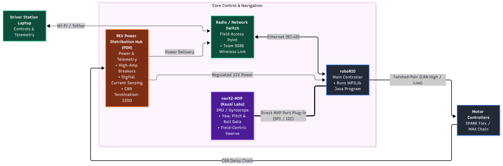
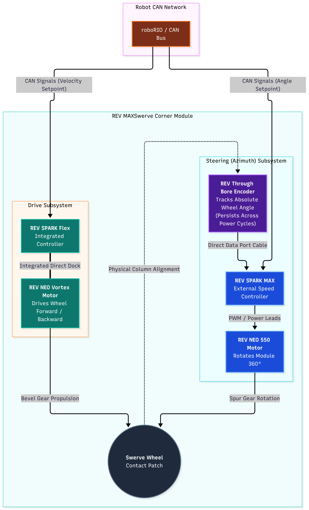

# Team 9086 Robot Hardware & Software Architecture Guide

This document maps the physical components of the robot directly to the Java WPILib code and control systems.

---

## 1. Hardware Inventory & Control Topology

Our robot utilizes an all-REV electronics ecosystem paired with an NI roboRIO and Kauai Labs navX2 IMU.

### A. Core Control & Navigation
* **roboRIO:** The main robot controller executing our WPILib Java program.
* **navX2-MXP (Kauai Labs):** Plugged directly into the roboRIO expansion port (MXP). Provides yaw heading, pitch, and roll data essential for field-centric swerve driving.
* **Radio / Network Switch:** Communicates over Ethernet to the driver station.
* **REV Power Distribution Hub (PDH):** Manages power delivery with high-amp breakers and digital current sensing. Terminate CAN bus here.

### B. Drivetrain: REV MAXSwerve Modules (x4)
Each corner module utilizes two motors and an integrated encoder:
* **Drive Motor:** REV NEO Vortex motor powered by an integrated REV SPARK Flex controller. Drives the wheel forward/backward.
* **Steering (Azimuth) Motor:** REV NEO 550 motor managed by an external REV SPARK MAX controller. Rotates the module 360 degrees.
* **Absolute Encoder:** REV Through Bore Encoder plugged directly into the SPARK MAX data port to track absolute wheel angle across power cycles.

<!--  -->

   

### C. Superstructure & Mechanisms
* **Intake / Roller Wheels:** Driven by standard REV NEO brushless motors (REV-21-1650) and controlled by standalone SPARK MAX units.

---

## 2. CAN Bus Wiring & Device Addressing

All motor controllers and the PDH communicate across a twisted-pair CAN network (Yellow = CAN High, Green = CAN Low):
* Starts at the **roboRIO CAN port**.
* Loops through every **SPARK MAX** and **SPARK Flex** in series.
* Ends at the **REV PDH**, with the CAN termination switch set to **ON (120Ω)**.

### Recommended CAN ID Assignment Map

| Subsystem / Component | Hardware Device | Recommended CAN ID Range | Configuration Tool |
| :--- | :--- | :---: | :--- |
| Core Hub | REV PDH | `1` | REV Hardware Client |
| Front Left Swerve (Drive / Turn) | SPARK Flex / SPARK MAX | `11` (Drive) / `12` (Turn) | REV Hardware Client |
| Front Right Swerve (Drive / Turn) | SPARK Flex / SPARK MAX | `21` (Drive) / `22` (Turn) | REV Hardware Client |
| Back Left Swerve (Drive / Turn) | SPARK Flex / SPARK MAX | `31` (Drive) / `32` (Turn) | REV Hardware Client |
| Back Right Swerve (Drive / Turn) | SPARK Flex / SPARK MAX | `41` (Drive) / `42` (Turn) | REV Hardware Client |
| Intake / Manipulator Rollers | SPARK MAX | `51` - `55` | REV Hardware Client |
| Gyroscope (navX2) | MXP Expansion Board | N/A (Direct SPI/I2C via MXP) | WPILib Class (`AHRS`) |

---

## 3. Software Architecture (WPILib Command-Based Java)

The robot software is structured around modular subsystems, separating drivetrain control from mechanism logic.

### A. Drivetrain Subsystem (`DriveSubsystem.java`)
* Manages four individual `MAXSwerveModule` objects.
* Reads heading angle continuously from the `AHRS` navX2 sensor.
* Utilizes WPILib's `SwerveDriveKinematics` to translate human driver inputs ($X$ velocity, $Y$ velocity, and rotational velocity $\omega$) into individual wheel speeds and angles.
* Implements **Field-Oriented Control**: Pushing the joystick forward drives the robot down the field away from the driver station, regardless of which direction the robot front is facing.

### B. Module Control Layer (`MAXSwerveModule.java`)
* Controls one SPARK Flex (Drive) and one SPARK MAX (Turn).
* Employs on-board PID controllers inside the SPARKs for fast, low-latency velocity and position control.
* Reads absolute encoder offsets to align wheels straight forward upon boot.

### C. Mechanism Subsystems (Intake / Feeder)
* Configured using basic `CANSparkMax` motor instances.
* Controlled via straightforward commands (e.g., `RunIntake`, `ReverseIntake`, `StopIntake`) bound to controller buttons.

---

## 4. Bench Testing & Calibration Protocol

> [!CAUTION]
> Never deploy untested swerve code or tune PID loops with the robot wheels resting on the floor.

1. **Safety Stand First:** Place the robot frame securely onto the wooden test stand so all four swerve modules rotate freely in the air.
2. **Firmware & ID Verification:** Connect each SPARK to a laptop running the **REV Hardware Client** via USB-C to ensure consistent firmware versions and non-conflicting CAN IDs.
3. **Zero the Absolute Encoders:** Physically align all four wheels pointing straight forward with a straight edge, read their absolute encoder positions in REV Hardware Client, and save these values into your code as module angular offsets.
4. **Drive Check:** Enable in Teleop and gently verify:
   * Do all wheels point in the commanded direction?
   * Does turning rotate all four wheels in a tangent circle?
   * Does pushing forward drive all four wheels forward in parallel?