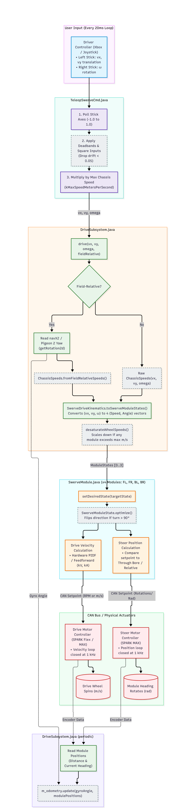

# Advanced Swerve Drive Architecture

## 1. Hardware Pipeline: How the Motors Actually Work

Each of the four corners uses a self-contained swerve module driven by two distinct motors:

```text
[ roboRIO ] --- CAN Bus ---> [ Drive Controller (SPARK Flex / NEO Vortex) ] ---> Wheel Rotation (Velocity)
            --- CAN Bus ---> [ Steer Controller (SPARK MAX / NEO 550)    ] ---> Azimuth Heading (Angle)
                                     ^
                                     | (Direct Data Port via 10-pin cable)
                             [ REV Through Bore Encoder ] (Absolute Wheel Angle)
```

### The Drive Motor (Velocity Closed-Loop)
* **Hardware:** REV SPARK Flex paired with a NEO Vortex (or SPARK MAX + NEO).
* **Role:** Drives wheel linear velocity ($m/s$).
* **Control Mode:** Runs a hardware-level PIDF velocity loop directly on the SPARK processor.
* **Calculation:** The code sends a setpoint in RPM or $m/s$. The internal relative encoder (hall sensors inside the brushless motor) closes the loop at $1\text{ kHz}$ directly on the controller, freeing the roboRIO from rapid voltage updates.

### The Steer / Azimuth Motor (Position Closed-Loop)
* **Hardware:** REV SPARK MAX paired with a NEO 550 (geared down via planetary or spur stages, typically around $12:1$ to $46:1$).
* **Role:** Orients the wheel heading ($\theta$).
* **Sensor Integration (REV Through Bore Encoder):**
  * Plugged directly into the SPARK MAX data port.
  * Measures absolute position across $360^\circ$ ($0$ to $2\pi$ radians) using a duty-cycle/PWM signal.
  * Even if the robot loses power or the wheel gets bumped on the cart, this sensor knows the exact mechanical orientation the instant power returns.

## 2. File Organization & Responsibilities

In WPILib Command-Based architecture, swerve is split across four core files to maintain strict separation of concerns:

| File | Primary Responsibility | Key WPILib Types Used |
| :--- | :--- | :--- |
| `Constants.java` | Physical dimensions, gear ratios, CAN IDs, conversion factors, PID gains | `Translation2d`, `PIDController` |
| `SwerveModule.java` | Low-level driver for a single corner (1 drive SPARK + 1 steer SPARK + 1 absolute encoder) | `SwerveModuleState`, `SwerveModulePosition` |
| `DriveSubsystem.java` | Coordinates all 4 modules, reads the gyro (navX2), updates odometry | `SwerveDriveKinematics`, `SwerveDriveOdometry`, `ChassisSpeeds` |
| `TeleopSwerveCmd.java` | Reads controller sticks, calculates deadbands, translates field-relative commands | `Command`, `CommandXboxController` |

---

## 3. The Signal Chain: From Controller Stick to Wheel Movement

How moving the left thumbstick forward translates into physical motion:

```text
[Driver Controller] (Raw stick -1.0 to +1.0)
         │
         ▼
[TeleopSwerveCmd]   (Apply deadbands, square inputs, scale by MaxSpeed -> vx, vy, omega)
         │
         ▼
[DriveSubsystem]    (ChassisSpeeds.fromFieldRelativeSpeeds using Gyro Yaw)
         │
         ▼
[Kinematics Engine] (SwerveDriveKinematics.toSwerveModuleStates)
         │
         ├──────────────┬──────────────┬──────────────┐
         ▼              ▼              ▼              ▼
    [Module FL]    [Module FR]    [Module BL]    [Module BR]
         │              │              │              │
    (Optimize)     (Optimize)     (Optimize)     (Optimize)
         │              │              │              │
    [Set Drive]    [Set Steer]    [Set Drive]    [Set Steer]
     (SPARK PID)    (SPARK PID)    (SPARK PID)    (SPARK PID)
```

### Step 1: Controller Polling (`TeleopSwerveCmd.java`)
The driver’s `CommandXboxController` outputs values between `-1.0` and `+1.0`.
* **Deadband Check:** Any value below $0.05$ or $0.08$ is clamped to zero to stop stick drift.
* **Scaling:** Values are multiplied by `Constants.DriveConstants.kMaxSpeedMetersPerSecond`.
* **Execution:** The command calls `driveSubsystem.drive(vx, vy, omega, fieldRelative)`.

### Step 2: Field-Centric Conversion (`DriveSubsystem.java`)
Drivers think relative to the stadium driver station, not the robot's front bumper.
* If the robot is pointing $90^\circ$ right and the driver pushes straight forward, the robot must travel downfield (to its left).
* WPILib handles this coordinate rotation internally:

```java
ChassisSpeeds speeds = fieldRelative
    ? ChassisSpeeds.fromFieldRelativeSpeeds(vx, vy, omega, getRotation2d())
    : new ChassisSpeeds(vx, vy, omega);
```

### Step 3: Inverse Kinematics (`SwerveDriveKinematics`)

`SwerveDriveKinematics` uses the physical $(X, Y)$ offset of each module relative to the center of rotation to break `ChassisSpeeds` ($v_x, v_y, \omega$) into 4 distinct `SwerveModuleState` objects (each holding a target velocity and target angle):

```java
SwerveModuleState[] moduleStates = kinematics.toSwerveModuleStates(speeds);
SwerveDriveKinematics.desaturateWheelSpeeds(moduleStates, kMaxSpeedMetersPerSecond);
```

> **Desaturation:** If rotation plus translation asks any wheel to spin faster than physically possible (e.g., $5.2\text{ m/s}$ on a motor capped at $4.5\text{ m/s}$), `desaturateWheelSpeeds` scales all four module speeds down proportionally so the robot maintains its intended path trajectory.

### Step 4: Angle Optimization (`SwerveModule.java`)
Before sending commands to the motors, each module runs state optimization:
* **The Problem:** If a wheel is at $0^\circ$ and receives a command to go $180^\circ$ at $2\text{ m/s}$, spinning the steering motor $180^\circ$ wastes time.
* **The Solution:** Reverse the drive motor direction ($-2\text{ m/s}$) and keep the wheel heading at $0^\circ$.
* WPILib simplifies this with a single call:

```java 
SwerveModuleState optimizedState = SwerveModuleState.optimize(desiredState, getHeading());
```

## 4. Periodic Resets, Offsets, and Odometry

### The 20ms Periodic Execution Loop
Every 20 milliseconds ($50\text{ Hz}$), WPILib executes `RobotPeriodic()` and `Subsystem.periodic()`:


```java
@Override
public void periodic() {
    // 1. Read actual module sensor positions
    SwerveModulePosition[] positions = new SwerveModulePosition[] {
        m_frontLeft.getPosition(),
        m_frontRight.getPosition(),
        m_backLeft.getPosition(),
        m_backRight.getPosition()
    };

    // 2. Feed positions + current gyro heading into Odometry
    m_odometry.update(getRotation2d(), positions);
}
```

### Why Wheels Drift and How Zeroing Works

* **Mechanical Mounting Offsets:**  
  When the absolute encoder is mounted, its magnet will not sit at exact true physical zero. During pit preparation, wheels are aligned using a straight edge or jig, and the raw reading from the absolute encoder is recorded in `Constants.java` as `kFrontLeftAngleOffset`.  
  When the module initializes:
  $$\text{True Heading} = \text{Raw Absolute Angle} - \text{Offset}$$

* **Syncing the Relative Steer Encoder:**  
  The NEO 550’s internal relative encoder has no gear lash and delivers clean velocity/position data, but loses its place on power loss. At startup, the `SwerveModule` constructor reads the absolute encoder position once and writes it directly to the SPARK MAX relative encoder:

```java
m_turningSparkMax.getEncoder().setPosition(getAbsoluteHeadingRadians());
```

* **Field Orientation Reset (Zero Gyro Button):**  
  If the robot gets spun during contact, the driver can tap a controller button (e.g., Controller **Y** or **Start**) to realign field coordinates:

```java
// In RobotContainer.java
driverController.y().onTrue(new InstantCommand(() -> m_robotDrive.zeroHeading()));
```

This does **not** physically rotate the wheels. It simply instructs the gyro software to set the current heading as $0^\circ$ (field forward).


